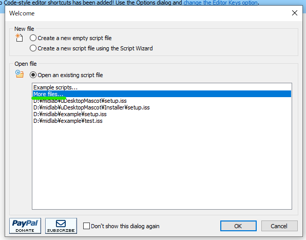
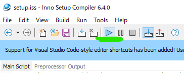

# uDesktopMascot

[](https://unity.com/releases/editor/archive)
[](https://github.com/MidraLab/uDesktopMascot/releases)
[](https://github.com/MidraLab/uDesktopMascot/actions/workflows/edit-test.yml)

Japanese | [English](README_EN.md) | [Chinese](README_CN.md) | [Spanish](README_ES.md) | [French](README_FR.md)

**Note**: The above languages (English, Chinese, Spanish, French) are generated by automatic translation from GPT-4o-mini. Please refer to the original text (Japanese) for accuracy and nuances.

<!-- TOC -->
* [uDesktopMascot](#udesktopmascot)
  * [Overview](#overview)
  * [Feature List](#feature-list)
  * [Running on macOS](#running-on-macos)
  * [Requirements](#requirements)
  * [License](#license)
  * [Material Information](#material-information)
  * [Creator Credits](#creator-credits)
  * [3rd Party Notices](#3rd-party-notices)
  * [Sponsor](#sponsor)
<!-- TOC -->

## Overview

"uDesktopMascot" is an open-source project for a desktop mascot application themed around `liberation of creativity`. As an example of its functionality, it can load models in VRM and GLB/FBX formats and display them on the desktop. Moreover, you can freely set the colors and background images of GUI elements such as the menu screen and application window. For a detailed list of features, please refer to the [Feature List](#feature-list).


**Supported Platforms**
* Windows 10/11
* macOS

## Feature List

The application implements the following features. For details, please refer to the list below.

You can add external assets by placing them in the StreamingAssets folder.

<details>

<summary>Model and Animation</summary>

* Loads and displays any model files placed in StreamingAssets.
  * Supports VRM (1.x, 0.x) format models.
  * Supports GLB/GLTF format models (animations are not supported).
  * Supports FBX format models (though some models may not load textures, and animations are not supported).
    * Textures can be loaded by placing them in StreamingAssets/textures/.

</details>

<details>

<summary>Voice and BGM</summary>

* Loads and plays audio files placed in SteamingAssets/Voice/. If there are multiple files, they will be played randomly.
  * The sound played upon clicking is loaded from audio files in StreamingAssets/Voice/Click/.
* Loads and plays music files placed in SteamingAssets/BGM/. If there are multiple files, they will be played randomly.
* Default voice for the character
  * The default voice uses sound from [COEIROINK: Tsukuyomi-chan](https://coeiroink.com/character/audio-character/tsukuyomi-chan).
  * This voice is played at application startup, application exit, and upon clicking.

</details>

<details>

<summary>Application Settings via Text File</summary>

You can change the application's settings through the application_settings.txt file.

The structure of the settings file is as follows:

```txt
[Character]
ModelPath=default.vrm
TexturePaths=test.png
Scale=3
PositionX=0
PositionY=0
PositionZ=0
RotationX=0
RotationY=0
RotationZ=0

[Sound]
VoiceVolume=1
BGMVolume=0.5
SEVolume=1

[Display]
Opacity=1
AlwaysOnTop=True

[Performance]
TargetFrameRate=60
QualityLevel=2
```

</details>

<details>

<summary>Menu Screen</summary>

* You can set a background image and background color for the menu screen.
  * The background image can be loaded from image files placed in StreamingAssets/Menu/. The supported image formats are:
    * PNG
    * JPG (JPEG)
    * BMP
    * GIF (still image)
    * TGA
    * TIFF
  * The background color can be specified using a color code.

</details>

## Running on macOS

When running the application on macOS, it may be blocked by GateKeeper. In this case, please execute the following command from the terminal.

```sh
xattr -r -c uDesktopMascot.app
```

## Requirements
* Unity 6000.0.31f1 (IL2CPP)

## License
* The code is licensed under [Apache License 2.0](LICENSE).
* The following assets are licensed under [CC BY-NC 4.0](https://creativecommons.org/licenses/by-nc/4.0/):
  * BGM
  * Models

## Material Information
* The default character animation is created using [Animation data collection for "VRM Doll Play"](https://fumi2kick.booth.pm/items/1655686). It has been confirmed that distribution including it in the repository is permitted.
* The font used is [Noto Sans Japanese](https://fonts.google.com/noto/specimen/Noto+Sans+JP?lang=ja_Jpan). It is redistributed under the [SIL OPEN FONT LICENSE Version 1.1](https://fonts.google.com/noto/specimen/Noto+Sans+JP/license?lang=ja_Jpan). The copyright for the font is held by the original author (Google).
* The default voice is from [COEIROINK: Tsukuyomi-chan](https://coeiroink.com/character/audio-character/tsukuyomi-chan). It has been confirmed in advance with COEIROINK regarding its usage.
* Button icons are made using [MingCute](https://github.com/MidraLab/MingCute).

## Instructions for Creating an Installer
### Windows
* Build the project in Unity with the name `uDesktopMascot` in the `build` folder.

* Install [Inno Setup](https://www.jrsoftware.org/isdl.php).
  
* Once opened, click on `More files` and select the `setup.iss` file under the project directory.
  

* After selection, click the play button.
  

* Once the build is completed, the installer will be generated at the root of the project.

### macOS
Installers can only be created on macOS PCs.

* Build the project in Unity with the name `uDesktopMascot` in the `build` folder.

* Execute the following command:
```sh
cd build
productbuild --component uDesktopMascot/uDesktopMascot.app /Applications ./uDesktopMascot_mac_installer.pkg
```
* Once the build is completed, the `uDesktopMascot_mac_installer.pkg` will be generated in the `build` folder.

## Creator Credits
* Model: "Aozora"
* BGM: MidraLab (eisuke)
* Software Icon: Yamucha

## 3rd Party Notices

See [NOTICE](./NOTICE.md).

## Sponsor
- Luna
- uezo